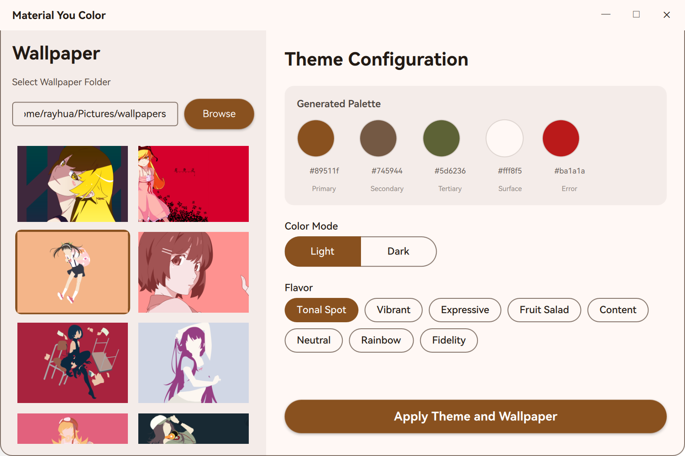
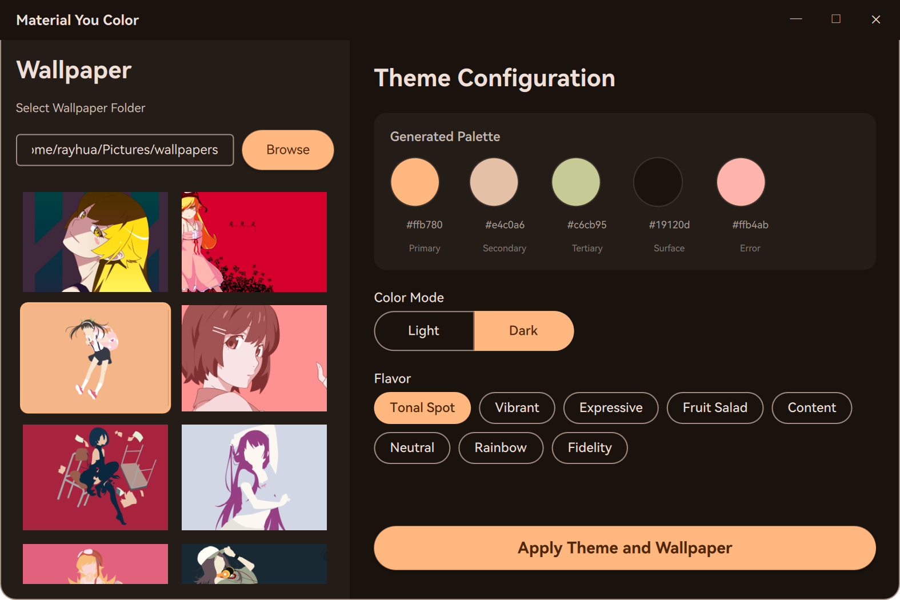

# 🎨 MaterialYou-Autothemer

[English](#english) | [中文](#chinese)



---

<a name="english"></a>
## 🇬🇧 English

> **Bring the beauty of Material Design 3 (Material You) to your Linux Desktop.**

**MaterialYou-Autothemer** is a powerful and elegant tool that automatically generates and applies Material You color schemes to your system based on your current wallpaper. It supports both **GNOME** and **KDE Plasma** desktop environments, offering a seamless and cohesive visual experience.

### ✨ Features

*   **Dynamic Theming**: Generates a complete Material Design 3 color palette from your wallpaper using [Matugen](https://github.com/InioX/matugen).
*   **Real-time Preview**: Visualize the generated palette, primary colors, and UI elements instantly before applying.
*   **Wallpaper Manager**: Browse local folders, preview images, and set your desktop wallpaper directly from the app.
*   **Customizable Flavors**: Choose from various generation algorithms:
    *   *Tonal Spot* (Default)
    *   *Vibrant*
    *   *Expressive*
    *   *Fruit Salad*
    *   *Rainbow*
    *   *And more...*
*   **Light & Dark Modes**: Fully supports system-wide light and dark theme switching.
*   **Cross-Desktop Support**:
    *   **GNOME**: Updates `adw-gtk3` and GTK4 settings.
    *   **KDE Plasma**: Generates and applies custom `.colors` schemes with proper metadata injection.
*   **Modern UI**: A polished, responsive interface built with **PySide6 (Qt/QML)** featuring custom window controls, animations, and tooltips.

### 🛠️ Prerequisites

Before installing, ensure you have the following dependencies:

1.  **Python 3.10+**
2.  **Matugen**: The core engine for color generation.
    ```bash
    cargo install matugen
    # Or check your distribution's package manager
    ```
3.  **PySide6**: Required for the GUI.
    ```bash
    pip install PySide6
    # Arch Linux: sudo pacman -S python-pyside6
    # Ubuntu/Debian: sudo apt install python3-pyside6
    ```
4.  **Desktop Specifics**:
    *   **GNOME**: `sassc` (required for compiling GTK themes).
    *   **KDE**: Standard Plasma desktop tools.

### 📥 Installation

1.  **Clone the repository**:
    ```bash
    git clone https://github.com/yourusername/MaterialYou-Autothemer.git
    cd MaterialYou-Autothemer
    ```

2.  **Run the installation script**:
    This script sets up the directory structure, installs the backend service, and creates a desktop entry.
    ```bash
    chmod +x install.sh
    ./install.sh
    ```

3.  **That's it!** You can now launch the app from your application menu.

### 🚀 Usage

1.  Open **Material You Theme** from your app launcher.
2.  **Select Wallpaper**:
    *   Click "Browse" to choose a folder containing your images.
    *   Click on any image in the grid to preview its color palette.
3.  **Configure Theme**:
    *   **Color Mode**: Switch between *Light* and *Dark* modes.
    *   **Flavor**: Select a flavor style (hover over buttons to see descriptions).
    *   **Preview**: Hover over the generated color circles to see their names and hex codes.
4.  **Apply**:
    *   Click the **Apply Theme and Wallpaper** button.
    *   Your system theme and wallpaper will update instantly.

### 🔧 Architecture

*   **Frontend**: A Python application using `PySide6` and `QML` for a fluid, hardware-accelerated UI.
*   **Backend Service**: A background process (`bridge.py`) managed by `systemd --user`. It listens for configuration changes and handles the heavy lifting of applying themes to specific desktop environments.
*   **Configuration**: Settings are stored in `~/.config/MaterialYou-Autothemer/config.conf`.
*   **Logs**: Debug logs are available at `~/.cache/MaterialYou-Autothemer/logs/backend.log`.

### ❓ Troubleshooting

**The theme isn't applying?**
Check the status of the background service:
```bash
systemctl --user status materialyou-autothemer.service
```

**Need more details?**
View the live logs:
```bash
tail -f ~/.cache/MaterialYou-Autothemer/logs/backend.log
```

---

<a name="chinese"></a>
## 🇨🇳 中文

> **将 Material Design 3 (Material You) 的美学带入您的 Linux 桌面。**

**MaterialYou-Autothemer** 是一个强大且优雅的工具，它可以根据您当前的壁纸自动生成并应用 Material You 配色方案到您的系统中。它支持 **GNOME** 和 **KDE Plasma** 桌面环境，提供无缝且统一的视觉体验。

### ✨ 功能特性

*   **动态主题**：使用 [Matugen](https://github.com/InioX/matugen) 根据您的壁纸生成完整的 Material Design 3 调色板。
*   **实时预览**：在应用之前，即时预览生成的调色板、主色调和 UI 元素。
*   **壁纸管理**：直接在应用中浏览本地文件夹、预览图片并设置桌面壁纸。
*   **多种风格 (Flavors)**：提供多种生成算法供选择：
    *   *Tonal Spot* (默认)
    *   *Vibrant* (鲜艳)
    *   *Expressive* (表现力)
    *   *Fruit Salad* (水果沙拉)
    *   *Rainbow* (彩虹)
    *   *更多...*
*   **深浅色模式**：完全支持系统级的深色和浅色主题切换。
*   **跨桌面支持**：
    *   **GNOME**：更新 `adw-gtk3` 和 GTK4 设置。
    *   **KDE Plasma**：生成并应用带有正确元数据的自定义 `.colors` 配色方案。
*   **现代 UI**：基于 **PySide6 (Qt/QML)** 构建的精致响应式界面，具有自定义窗口控件、动画效果和悬浮提示。

### 🛠️ 环境要求

在安装之前，请确保您已安装以下依赖：

1.  **Python 3.10+**
2.  **Matugen**：用于生成颜色的核心引擎。
    ```bash
    cargo install matugen
    # 或者检查您的发行版包管理器
    ```
3.  **PySide6**：GUI 界面所需。
    ```bash
    pip install PySide6
    # Arch Linux: sudo pacman -S python-pyside6
    # Ubuntu/Debian: sudo apt install python3-pyside6
    ```
4.  **桌面特定依赖**：
    *   **GNOME**：`sassc` (用于编译 GTK 主题)。
    *   **KDE**：标准的 Plasma 桌面工具。

### 📥 安装指南

1.  **克隆仓库**：
    ```bash
    git clone https://github.com/yourusername/MaterialYou-Autothemer.git
    cd MaterialYou-Autothemer
    ```

2.  **运行安装脚本**：
    该脚本将设置目录结构、安装后台服务并创建桌面快捷方式。
    ```bash
    chmod +x install.sh
    ./install.sh
    ```

3.  **完成！** 您现在可以从应用菜单启动该应用。

### 🚀 使用说明

1.  从应用启动器打开 **Material You Theme**。
2.  **选择壁纸**：
    *   点击 "Browse" 选择包含图片的文件夹。
    *   点击网格中的任意图片以预览其调色板。
3.  **配置主题**：
    *   **颜色模式 (Color Mode)**：在 *Light* (浅色) 和 *Dark* (深色) 模式之间切换。
    *   **风格 (Flavor)**：选择一种风格样式（悬停在按钮上可查看描述）。
    *   **预览**：悬停在生成的颜色圆圈上以查看其名称和十六进制代码。
4.  **应用**：
    *   点击 **Apply Theme and Wallpaper** 按钮。
    *   您的系统主题和壁纸将立即更新。

### 🔧 架构说明

*   **前端**：使用 `PySide6` 和 `QML` 开发的 Python 应用程序，提供流畅的硬件加速 UI。
*   **后台服务**：由 `systemd --user` 管理的后台进程 (`bridge.py`)。它监听配置更改并处理将主题应用到特定桌面环境的繁重工作。
*   **配置**：设置存储在 `~/.config/MaterialYou-Autothemer/config.conf`。
*   **日志**：调试日志位于 `~/.cache/MaterialYou-Autothemer/logs/backend.log`。

### ❓ 故障排除

**主题没有应用？**
检查后台服务的状态：
```bash
systemctl --user status materialyou-autothemer.service
```

**需要更多详细信息？**
查看实时日志：
```bash
tail -f ~/.cache/MaterialYou-Autothemer/logs/backend.log
```

---

## 📜 License

This project is licensed under the MIT License. See the [LICENSE](LICENSE) file for details.
